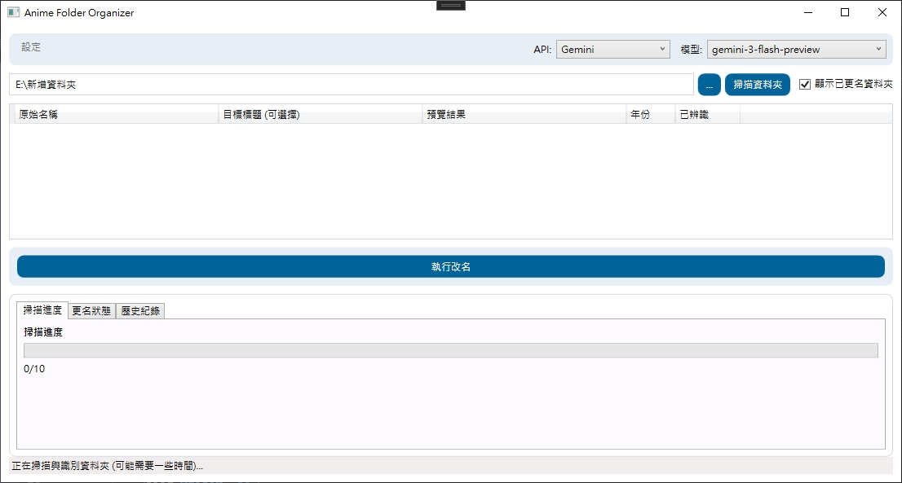
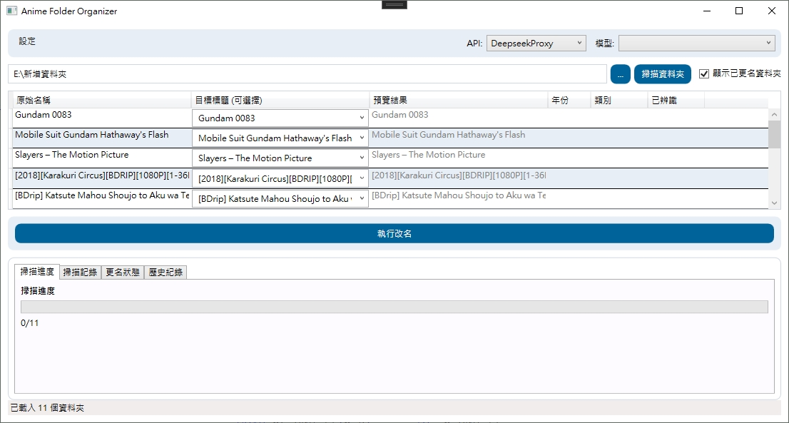
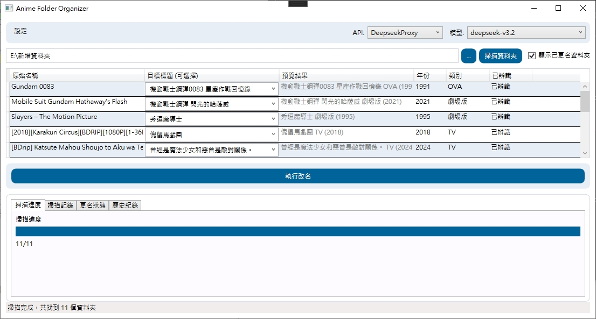
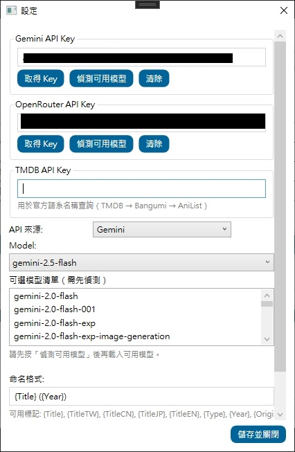

# Anime Folder Organizer (動畫資料夾整理工具)

這是一個基於 WPF (.NET 9) 開發的桌面應用程式，利用 AI 服務（Google Gemini / OpenRouter）的語言理解能力，協助使用者智慧辨識並自動整理動畫資料夾名稱。

## 專案概述

整理大量動畫資料夾通常是一件繁瑣的工作，資料夾名稱可能包含各種不規則的資訊（如字幕組、解析度、集數等）。本專案旨在解決此問題，透過 AI 分析資料夾名稱，提取出動畫的正式標題（支援多語言）與年份，並根據使用者自訂的格式進行標準化重新命名。

### 主要功能

*   **AI 智慧辨識**：整合 Google Gemini / OpenRouter API，精準分析資料夾名稱中的動畫資訊。
*   **批量處理**：一次掃描並處理多個資料夾。
*   **自訂命名格式**：支援自訂命名規則（例如：`{Title} ({Year})`），並提供 `{Type}`（TV / OVA / 特別版 / 劇場版）。
*   **多語言支援**：可選擇偏好的命名語言（繁體中文、日文、英文等）。
*   **模型可用性偵測**：Gemini / OpenRouter 皆可偵測可用模型並快取至下次重新偵測。
*   **作品驗證**：將辨識的日文名稱與 AnimeDB 進行比對，顯示「已辨識 / 驗證失敗」狀態。
*   **官方名稱補正**：以 TMDB → Bangumi → AniList 取得官方語系名稱，僅在缺少繁中時以簡中轉繁。
*   **歷史紀錄**：內建 SQLite 資料庫，記錄所有更名操作，方便追蹤。
*   **預覽功能**：在實際更名更動前，提供新舊名稱對照預覽。
*   **掃描記錄**：提供掃描與辨識的詳細紀錄，方便除錯。

## ScreenShot






## 技術堆疊

*   **平台**：Windows (WPF)
*   **框架**：.NET 9.0
*   **架構**：MVVM (使用 CommunityToolkit.Mvvm)
*   **依賴注入**：Microsoft.Extensions.DependencyInjection
*   **資料庫**：SQLite (Microsoft.Data.Sqlite)
*   **AI 服務**：Google Gemini API / OpenRouter

## 安裝指南

### 事前準備

1.  **作業系統**：Windows 10/11
2.  **執行環境**：需安裝 [.NET 9.0 Desktop Runtime](https://dotnet.microsoft.com/en-us/download/dotnet/9.0)。
3.  **API Key**：
    *   Google Gemini 或 OpenRouter API Key（必要）。
    *   TMDB API Key（用於官方名稱補正，可選）。
    *   Gemini 可至 [Google AI Studio](https://aistudio.google.com/app/apikey) 申請，OpenRouter 可至 [OpenRouter](https://openrouter.ai/keys) 申請。

### 建置步驟

如果您是開發者並希望自行編譯原始碼：

1.  複製專案庫：
    ```bash
    git clone https://github.com/yourusername/AnimeFolderOrganizer.git
    cd AnimeFolderOrganizer
    ```

2.  使用 Visual Studio 2022 開啟 `AnimeFolderOrganizer.sln` 或使用 CLI 建置：
    ```bash
    dotnet build
    ```

3.  執行程式：
    ```bash
    dotnet run --project AnimeFolderOrganizer
    ```

## 使用說明

1.  **初次設定**：
    *   啟動程式後，點擊右上角的「設定」。
    *   在設定視窗輸入對應的 API Key（Gemini / OpenRouter 彼此獨立）。
    *   若要啟用官方名稱補正，請輸入 TMDB API Key。
    *   按「偵測可用模型」，載入可用模型清單（會快取到下次重新偵測）。
    *   選擇 API 來源與模型，並設定命名格式。
    *   點擊「儲存並關閉」。

2.  **掃描資料夾**：
    *   回到主畫面，點擊「選擇資料夾」按鈕，選取包含動畫資料夾的根目錄。
    *   程式會列出該目錄下的子資料夾。

3.  **掃描與辨識**：
    *   點擊「掃描資料夾」，程式將呼叫 Gemini / OpenRouter API 取得建議名稱。
    *   作品名稱會與 AnimeDB 比對，欄位顯示「已辨識 / 驗證失敗」。

4.  **套用更名**：
    *   確認清單中的建議名稱。
    *   點擊「執行改名」以套用變更。

5.  **快速切換模型**：
    *   主畫面右上方可直接切換 API 與模型。

## 貢獻方式

歡迎任何形式的貢獻！如果您發現 Bug 或有新功能建議，請遵循以下步驟：

1.  Fork 本專案。
2.  建立您的 Feature Branch (`git checkout -b feature/AmazingFeature`)。
3.  提交您的變更 (`git commit -m 'Add some AmazingFeature'`)。
4.  推送到 Branch (`git push origin feature/AmazingFeature`)。
5.  開啟一個 Pull Request。

## 授權資訊

本專案採用 [MIT License](LICENSE) 授權。詳細資訊請參閱 LICENSE 檔案。

---
*注意：本專案使用 Google Gemini / OpenRouter API，使用量請遵循各平台的配額限制與服務條款。*
